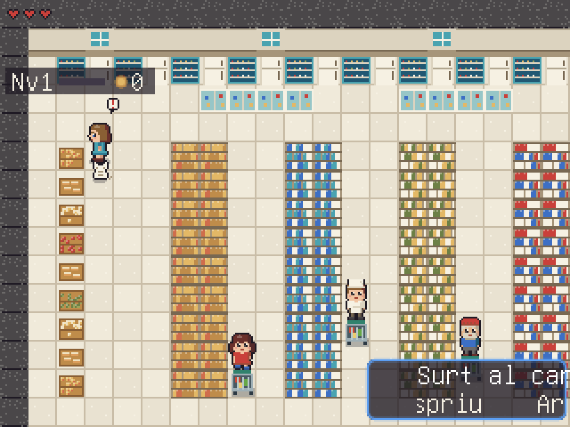
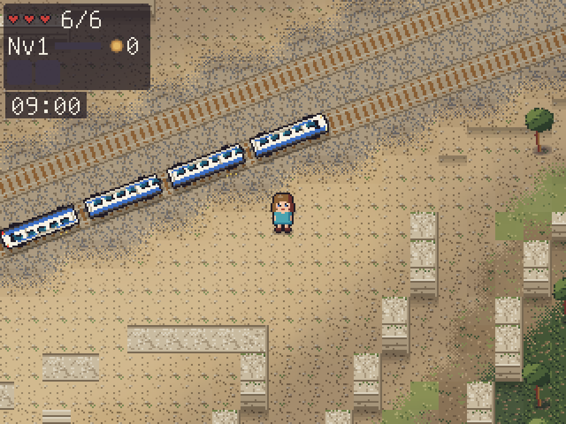

# RPG GPS Kit — a 2D adventure based on any real town

**English** · [Català / original engine documentation](README.md) · [Agent skill](SKILL.md)

[](https://paypal.me/sergigavilan)

Turn **GPS coordinates** into a top-down adventure: Pokémon Red/Blue-style exploration with Zelda-style combat.
Streets, squares, buildings, shops, schools, beaches and paths come from OpenStreetMap. Pixel art, music,
sound effects, characters, interiors and quests are generated in code, with no external art or audio assets required.

Designed for children aged five and up, with read-aloud text, word highlighting, uppercase mode and quests
that help them discover their town. **Game text is currently in Catalan**; this is the English documentation
and agent skill, not a localization of the game.

The project began as a game of Roda de Berà, in Catalonia. This kit packages its engine with Altafulla as the sample location.

## Screenshots

These are real gameplay captures from **Roda RPG, the original game derived from this engine**.
They illustrate its visual style; Roda-specific scenery and features are not a guarantee of what the
current kit or a newly generated town includes. On-screen text is in Catalan.

### Explore the town


Public places, outdoor scenery and characters to meet.

### Step inside a shop



An example of a generated interior with furniture and NPCs.

### Discover the railway



Railway scenery and a passenger train in the Roda game.

## Create a game for a new location

Work in a dedicated clone: the location generator replaces location-specific data.
The commands below use Altafulla's town coordinates as an example; replace the name and coordinates for your town.

```sh
git clone https://github.com/aewnor/rpg-gps-kit.git my-town-rpg
cd my-town-rpg
sudo apt install love luajit python3-numpy python3-pil   # Requires LÖVE 11.5
python3 tools/new_location.py --name "Altafulla" --lat 41.1418 --lon 1.3786 --size-km 3.2
make newmaps     # Streets, services, local quests and map
make art         # Tiles, sprites and shop signs
make validate    # Content reachability and palette checks
make unit        # Check the exit code, not just printed OK messages
love .
```

The generator downloads OSM data through Overpass, writes the projection to `data/world.json`
(4 meters per tile), and clears data belonging to the previous location.

- `make_services.py` finds local services such as the town hall, police, post office, health center,
  school, library, supermarkets, sports center, station and restaurants, and places an NPC at the entrance.
- `make_missions.py` generates the “Get to know your town” chapter and adds reusable chapters from
  `data/missions.base.json`, covering family and friends, road safety, the group, workshop and farm.
- `make_locals.py` creates door signs from named OSM shops and bars.
- Caves, the tower, dungeon and dragon's lair are placed automatically in countryside away from houses.

For map adjustments, file locations, quest targets, privacy rules and known pitfalls, read [the English skill](SKILL.md).
For interior changes, mobile controls and release validation, read [the English maintenance guide](references/maintenance.md).
Detailed historical engine documentation remains in the [original README](README.md#documentació-del-motor).

## Browser and mobile build

```sh
cd tools/web && npm install && cd ../..
sh tools/build_web.sh                # Build a candidate in releases/<id>
```

A build alone does not activate the candidate. Follow the [web deployment workflow](references/maintenance.md#web-deployment)
to test and activate it. Once a release is active:

```sh
python3 tools/web_server.py           # http://localhost:8102; editor at /editor
```

The editor and AI conversations integrate with an optional hub (`HUB_ADULT_URL`, `HUB_GROQ_URL`).
Without the hub, the game still works with fixed dialogue.

## Use as an agent skill

The English entry point is [`SKILL.md`](SKILL.md), with supporting instructions in
[`references/maintenance.md`](references/maintenance.md). Ask your coding agent to read it when generating
a town or maintaining a derived game. Keep the references alongside the skill if you copy it into your
agent's skill directory. The original Catalan version is preserved in [`SKILL.ca.md`](SKILL.ca.md).

Example request:

> Use the rpg-gps-kit skill to create an adventure for Altafulla at 41.1418, 1.3786, with a 3.2 km map.
> Generate the map, art and local quests, then run the content checks and unit tests.

## Support

If the kit is useful to you, you can [buy me a coffee through PayPal](https://paypal.me/sergigavilan). ☕

## License and credits

- Map data © [OpenStreetMap contributors](https://www.openstreetmap.org/copyright), ODbL 1.0.
  Retain attribution in games made with the kit; the game already displays it.
- Code, generated graphics and music: [GNU GPL v3](LICENSE). You may use, modify and distribute the kit;
  when distributing a derived game, share its source under the same license.
- See [third-party credits](docs/credits.md).
