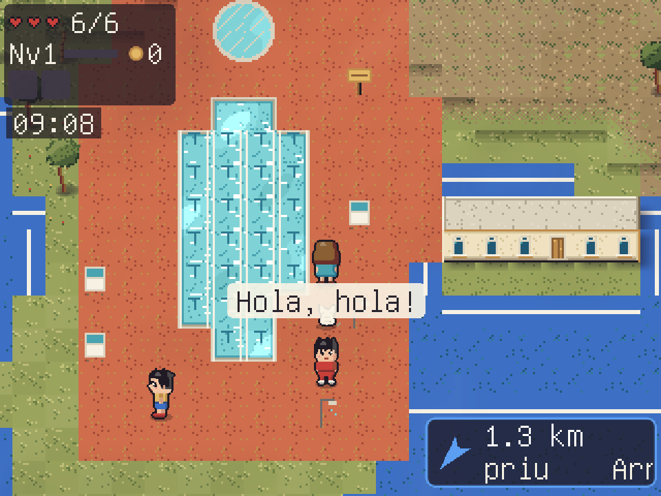

# RPG GPS Kit — una aventura 2D de qualsevol poble

**Català** · [English — guide and screenshots](README.en.md) · [Skill en català](SKILL.ca.md)

[](https://paypal.me/sergigavilan)

Kit per crear un joc d'aventura cenital (exploració a l'estil Pokémon Vermell/Blau, combat a l'estil Zelda) **a
partir d'unes coordenades GPS**. Els carrers, les places, els edificis, les botigues, les escoles, les platges i
els camins surten d'OpenStreetMap. Gràfics pixel art, música, sons, personatges, interiors i missions es generen
per codi: no cal cap recurs extern. Pensat per a nens i nenes (des de 5 anys): textos en català, lectura en veu alta
amb ressaltat de paraules, mode de lletra majúscula i missions per conèixer el propi poble.

Va néixer com un joc de Roda de Berà (Tarragonès). El kit inclou aquest motor amb un exemple d'Altafulla.

## Captures de pantalla

Captures reals de **Roda RPG**, el joc original. Mostren l'estil del motor; els escenaris i les funcions específiques de Roda poden diferir del kit i d'un poble acabat de generar.



[Veure la galeria amb botigues i ferrocarril →](README.en.md#screenshots)

## Crear el joc d'un lloc nou

```sh
sudo apt install love luajit python3-numpy python3-pil   # LÖVE 11.5
python3 tools/new_location.py --name "El meu poble" --lat 41.1418 --lon 1.3786 --size-km 3.2
make newmaps     # carrers, serveis, missions «Coneix el teu poble» i mapa (1-3 min)
make art         # tiles, sprites i rètols de botigues (cal una vegada, o si canvien els locals)
make validate    # comprova que es pugui arribar a tot
love .           # a jugar
```

- `new_location.py` descarrega l'OSM del quadrat (Overpass) i el límit del municipi, escriu `data/world.json`
  (projecció: 4 m per casella) i posa en blanc les dades que eren d'un altre lloc.
- `make_services.py` busca ajuntament, policia, correus, centre de salut, escola, biblioteca, súpers,
  poliesportiu, estació i restaurants a l'OSM, i hi posa un personatge a la porta.
- `make_missions.py` fa el capítol «Coneix el teu poble» (casa, serveis, places i carrers del lloc) i hi afegeix
  els capítols genèrics de `data/missions.base.json` (família i amics, seguretat viària, la colla, el taller, la granja).
- `make_locals.py` converteix les botigues i bars amb nom de l'OSM en rètols damunt la porta.
- Les coves, la torre, la masmorra i el cau del drac es col·loquen soles al camp, lluny de les cases.

Més detalls, problemes coneguts i com retocar el mapa: [`SKILL.md`](SKILL.md).

### Versió web (navegador i mòbil)

```sh
cd tools/web && npm install && cd ../..
tools/build_web.sh                    # love.js → releases/<id>
python3 tools/web_server.py           # http://localhost:8102 (joc) i /editor (editor de mapes i missions)
```
L'editor i la IA dels personatges fan servir un «hub» opcional (`HUB_ADULT_URL`, `HUB_GROQ_URL`); sense hub, el
joc funciona igual amb les frases fixes.

## Dóna suport

Si el kit et serveix, pots convidar-me a un cafè: **https://paypal.me/sergigavilan** ☕

## Llicència i crèdits

- Dades de mapa © [OpenStreetMap contributors](https://www.openstreetmap.org/copyright), ODbL 1.0: cal citar-ho
  als crèdits del joc que en facis (el joc ja ho mostra).
- Codi, gràfics generats i música: [GNU GPL v3](LICENSE). Pots fer servir, modificar i distribuir el kit; si distribueixes
  un joc fet amb ell, comparteix-ne també el codi sota la mateixa llicència. Crèdits de tercers: [`docs/credits.md`](docs/credits.md).

---

# Documentació del motor

> Escrita per al joc original de Roda de Berà: els llocs concrets que s'hi citen (coves, port, parcs) són d'aquell mapa. En un lloc nou, el motor fa servir els equivalents que trobi a l'OSM.
## Jugar
```sh
sudo apt install love        # LÖVE 11.5
make maps                     # genera maps/runtime (solo la primera vez o tras cambiar el mapa)
love .                        # o: love build/roda-rpg.love
```
Controles: flechas/WASD caminar (también en diagonal) · Z/Intro hablar · X atacar · C escudo ·
V encanteri (con el Bastó màgic) · Q/E cambiar de encanteri · B bici (solo al aire libre) · H claxon/timbre
(en vehículo) · J diario · M mapa · Esc menú · F3 info. Mando: cruceta/stick, A, X atacar, LB/RB escudo, Y bici,
pulsar el stick izquierdo claxon, pulsar el derecho encanteri, Start. En el móvil, la cruceta es una zona circular de 8 direcciones.

## En el juego
- **Tráfico**: los coches frenan si te ven, pero si te cruzas muy cerca te atropellan (−1 corazón y
  empujón). En un **paso de peatones** se paran del todo. Ver «Fase 4» más abajo (motos, patinetes,
  peatones, claxon y pasos a nivel).
- **Día y noche**: 1 hora del juego = 1 minuto real (reloj arriba a la izquierda). De noche se
  encienden farolas, ventanas, escaparates, marquesinas y los faros de los coches.
- **Bus y viaje rápido**: las paradas (19, de OSM) se descubren al pasar cerca; en cualquier parada,
  hablar con la marquesina abre la lista de paradas conocidas y el bus te lleva.
- **Aspecto y temporada** (menú de pausa): aspectos en `data/skins.json` (generados por
  `tools/make_sprites.py`); temporadas en `data/themes.json` (Halloween 15‑oct–2‑nov, Nadal
  5‑des–7‑gen; se activan solas por fecha o se eligen a mano): adornos junto a puertas y farolas,
  luces y tinte nocturno.
- **Personajes con IA**: los que tienen «Parla amb IA» en el editor conversan con Groq (vía el
  `/api/groq` del hub, por `POST /api/npc_chat` del servidor del juego): respuesta corta en catalán y
  3 opciones para seguir. Si la IA no responde en 15 s, dicen sus frases fijas.
- **Entrar en cualquier edificio**: empujar hacia arriba (¼ s) una puerta o escaparate de fachada, o
  pulsar acción delante, abre un interior **procedural** (`src/world/procgen.lua`: casa con salón,
  dormitorio y cocina o baño; botiga; portal de pisos), con vecinos y a veces un gato. Misma puerta →
  mismo interior (semilla = posición). Se sale por la puerta de abajo, delante de la fachada.
- **Aspecto Nena** por defecto (pelo castaño en media melena, ojos azules, vestido azul claro, como
  el avatar del hub) y dos gatos (`npc_cat_orange`, `npc_cat_grey`) para el editor y los interiores.
- **Personajes y animación** (`tools/chars.py`): personajes dibujados por partes (pelo, ropa, complementos)
  con caminar de 4 pasos, parpadeo, sombra, polvo al pisar, estela de la espada, chispas y cámara que se
  adelanta. Nuevos NPC para el editor: `npc_tourist`, `npc_kid`, `npc_lady`. Ver `docs/art-guide.md`.

## RPG, servicios, vehículos y mazmorras
- **Nivel y equipo** (`src/systems/rpg.lua`): experiencia por enemigos, misiones, cofres y lugares nuevos;
  cada nivel pide ×1,5 XP y da +1 corazón (hasta 12), +3 ataque y +2 defensa. Cinco ranuras: arma, escudo,
  ropa, armadura y casco (`data/items.json`: `attack`, `defense`, `min_level`). Daño = arma × ataque / 10;
  la defensa resta de cada golpe (mínimo 1). Menú de pausa → **Personatge i equip** (equipo, inventario y
  vehículos). Monedas y gemas en el HUD.
- **Servicios del pueblo** (`data/services.json`, `src/systems/services.lua`), delante de su edificio real
  de OSM: Ajuntament (pagar multas, misión «Ruta dels serveis»), Policia Local (cartera perdida, consejos),
  Correus (paquetes), CAP (revisión gratis al día, farmacioles), Gimnàs (fuerza y agilidad), Bonpreu, Lidl
  (ofertas que cambian cada día) y supermercados (comprar y vender coleccionables), Biblioteca (endevinalles
  y Mapa antic), Casino Municipal («Trivial de Roda», sin apuestas), Poliesportiu y Camp de futbol (carreras
  contra reloj) y estaciones de tren (viaje rápido; dos baixadors son inventados). Correus y el gimnasio no
  están en OSM: ubicación aproximada.
- **Olaf, el gato** (`src/entities/follower.lua`): sigue al jugador por su mismo camino, en todas las escenas.
- **Cofres** (`data/loot.json`, `src/systems/loot.lua`): de madera en la montaña (30, junto a caminos a más
  de 50 m), de hierro y plata en la cueva y la mazmorra, y legendario al fondo de la **Masmorra del Castell**
  (`tools/make_dungeon.py`, nivel 3; trae el plano del coche). Botín determinista por cofre. Petxines y
  pinyes por el mapa para vender. Luz dinámica en cuevas y mazmorras (antorchas que parpadean; la
  llanterna amplía la luz, también de noche).
- **Vehículos** (`src/systems/vehicles.lua`, tecla B; se eligen en el menú): bicicleta, patinete eléctrico
  (Lidl, nivel 2), scooter 125 (nivel 3), moto de enduro (nivel 4) y turismo (nivel 6), los tres últimos con
  plano de cofre. Física: aceleración, frenada, giro limitado, rozamiento, superficie (asfalto, tierra,
  campo) y pendiente real del terreno. No suben escaleras.
- **Desnivel**: la capa `height` del mapa (altura del MDT en metros + superficie) llega al juego
  (`Map:height_at`): relieve sombreado con luz del noroeste, sombra en la base de cada desnivel y regla de
  paso `max_slope` (como mucho un nivel de 8 m entre casillas vecinas).

## Fase 4: tráfico inteligente, minijuegos, sonido y «juice»
- **Tráfico inteligente** (`src/systems/traffic.lua`): además de coches circulan motos, la moto de la
  Policia Local y patinetes eléctricos, cada tipo con su velocidad, aceleración, frenada y distancia de
  seguridad (`Traffic.KINDS`). Detección de obstáculos a lo largo del carril: si hay distancia de frenada se
  paran; si te cruzas muy cerca, solo frenan (y puede haber atropello). Si te plantas delante, esperan y
  tocan el claxon.
- **Peatones** (`src/systems/pedestrians.lua`): vecinos que llegan por la acera a un paso de cebra cercano,
  esperan en el bordillo a que ningún vehículo se acerque, cruzan perpendiculares a la calle y se van. El
  tráfico se para por ellos (cebra ocupada o con alguien esperando, si aún puede frenar). Con el claxon se
  sobresaltan (¡!). Como mucho 8 a la vez, solo cerca del jugador.
- **Trenes**: campana mientras el paso a nivel avisa o está cerrado, **barreras animadas** que bajan y suben
  atravesando la calle, el **tren de alta velocidad** (corredor `rail_hs`) pasa a 2,4× sin parar, y cuando
  un tren pasa cerca: chispas en las ruedas, retumbo (sacudida de cámara continua) y ruido de rodadura.
- **Minijuegos en los POIs** (`src/minigames/`, un módulo por juego con la misma interfaz; lógica en Lua
  puro probada con luajit). Los servicios con interior ofrecen **«Entrar»** (`Services.enter` →
  `procgen.poi`): el interior tiene aparatos (objetos `arcade`) que abren cada juego y el mismo personaje del
  servicio dentro. Al guardar dentro, al continuar se vuelve al mismo interior.
  - **Casino Municipal**: restaurante con carta, comedor y cocina, y sala con escenario y butacas.
    Teatro «La llavor viatgera» y corto «Un dia a la costa», originales del juego; A avanza y B sale.
    Conserva el Trivial de Roda. Se han retirado los juegos de azar y sus fichas, también en partidas antiguas.
  - **Poliesportiu / Camp de futbol**: *tanda de penaltis* (dirección y fuerza; el portero se tira a un lado)
    y, en el Poliesportiu, *circuito de agilidad* en bici o patinete (pasar entre conos contra el reloj).
  - **Gimnàs**: *entrenamiento al ritmo* con las flechas en tres aparatos: pesas → fuerza (+1 ataque), bici
    estática → **resistencia** (nueva: +1 defensa) y cinta → agilidad. Con un 70 % la sesión sube la
    estadística, una vez al día por aparato (máx. 10). El entrenador sigue vendiendo sesiones.
- **Sonido 8-bit** (`src/audio.lua`, todo sintetizado): música adaptativa con fundidos — día en el pueblo,
  noche tranquila con **grillos** (21–7 h), cuevas/mazmorra y **cimas** (≥ 70 m, con viento) con temas
  misteriosos y un tema arcade en los minijuegos. Efectos: pasos según el suelo (asfalto, hierba, tierra,
  arena, madera), maullido y ronroneo de Olaf, cofre con destellos, subir de nivel, monedas, motor del
  vehículo (tono según la velocidad), claxon/timbre, derrape, campana y barreras. **Rendimiento en la Pi**:
  la música se sintetiza por trozos en segundo plano (≤ 3 ms por frame) y se guarda como WAV en el
  directorio de datos (`audio_cache/`): desde la segunda partida carga al instante. Los efectos que se
  solapan tienen varias voces (`Source:clone`, mismo buffer).
- **«Juice»** (`src/fx/`): partículas en un bloque de memoria fijo (320 como máximo, sin crear tablas, y
  dibujadas en un solo `SpriteBatch`): polvo al derrapar, chispas en las vías, destellos y confeti en cofres,
  subidas de nivel y premios, hojas que caen en parques y jardines. **Sacudida de cámara** por «trauma»
  (golpes, impactos, cofre legendario) y retumbo cuando pasa un tren al lado. **Números flotantes** sobre el
  personaje: +XP, +monedas, ±HP (cualquier cambio de vida), daño a los enemigos y estadísticas.

## Fase 5: perfiles, amigos y familia, misiones «Coneix el teu poble»
- **Perfiles** (`src/profile.lua`, `src/ui/profiles.lua`; título → *Jugar (perfils)*): hasta **5 ranuras**
  independientes, cada una con su partida. Todo lo personal vive solo en el directorio de datos de LÖVE:
  `profiles/slot<N>/user_profile.json` (nombre, avatar, casa = `home_player_location`, amigos y familia) y
  `profiles/slot<N>/save.json`. Nunca en el paquete ni en el repositorio; lo leído se sanea siempre.
  *Partida ràpida* y *Continuar sense perfil* siguen funcionando como antes (con `home.json`).
- **Editor de avatar y de personajes**: cuerpo, tono de piel (6), peinado y color, ojos, ropa y colores,
  zapatos, sombrero y complementos (gafas, bolso, bufanda, barba; para los personajes también bastón y
  delantal) y edad (infant, adult, gran). Nombre con el teclado o con una rejilla de letras (mando).
- **Paperdoll** (`src/paperdoll/`): las hojas de personaje se generan en tiempo de ejecución por capas
  (piernas → tronco y ropa → cara → pelo → complementos → sombrero → contorno), port exacto de
  `tools/chars.py` y de las hojas de ataque, bici y vehículos: `tests/paperdoll_cases.py` compara 42 hojas
  píxel a píxel con las de Python. Así el avatar ataca y va en bici o moto con su propio aspecto.
- **Hasta 5 amigos o familiares** por perfil (amiga, amic, àvia, avi, tieta, tiet, cosina, cosí) con su casa
  elegida **en el mapa real** (vista general con el minimapa → vista de cerca con las puertas marcadas; se
  comprueba que se llega a pie) y su **interior** (casa o piso, suelo de parquet, baldosa o moqueta, gato
  sí/no). Su casa sale en el mapa y tiene cartel («Casa de …») al acercarse.
- **Horarios** (`src/systems/schedule.lua`): los niños van a la escuela por la mañana y al parque por la
  tarde, los abuelos pasean por el parque y la plaza, los adultos van a la plaza y al súper; de noche,
  todos en casa (en su interior). Los vecinos del mapa van al parque por la tarde y se recogen de noche;
  los servicios cierran de 21:30 a 7:30. Caminan con **A\*** (`src/world/astar.lua`: montículo binario,
  sin cortar esquinas, tope de nodos, solo chunks ya cargados y como mucho una búsqueda cada 0,2 s).
- **Reacciones**: saludan («Hola, Nena!», «Bon dia!») y, si pasas muy deprisa en un vehículo a su lado,
  se apartan de un salto y te riñen.
- **Misiones «Coneix el teu poble»** (`data/missions.json`, `src/systems/missions.lua`, vida del pueblo en
  `src/systems/town.lua`): capítulos progresivos — *Orientació* (Escola Salvador Espriu, metge, objeto
  perdido a la Policia Local, compra en el Bonpreu o el Lidl, Plaça de l'Església, Ajuntament), *Família i
  amics* (generadas para cada personaje del perfil: «Visita l'amiga», «Porta un encàrrec a casa dels
  avis», «Queda amb l'Olaf al Parc de la Masieta»: el gato se va y te espera allí) y *Seguretat i civisme*
  (cruzar por los pasos de cebra, esperar el semáforo en verde, reciclar en los contenedores por colores
  con un minijuego que explica cada error, coger el autobús).
- **Ayudas en pantalla**: brújula con flecha, distancia en metros y el objetivo; **cartel con el nombre
  oficial** de la calle, la plaza, el parque o la escuela al entrar (`data/streets.json`, de
  `tools/make_streets.py`: 605 calles, 29 plazas/parques/escuelas y 34 puntos de reciclaje de OSM);
  **diario de misiones** (tecla J o menú de pausa) con la lista de objetivos y un mapa con marcas de
  colores (azul orientación, rosa familia, verde seguridad); el mapa (M) marca las casas y el objetivo.
- **Semáforos**: uno de cada tres pasos de cebra de las calles con tráfico (OSM no tiene ninguno aquí:
  ubicación inventada). Coches con fase verde/ámbar/rojo y monigote para los peatones; los peatones del
  juego esperan el verde. Cruzar en rojo da un aviso y no cuenta en la misión.
- **Parques reconstruidos con la ortofoto** (`tools/decorate_map.py parks`): dentro de cada parque, jardín o
  plaza de OSM, cada casilla es césped, árbol, pavimento o tierra según la ortofoto PNOA (vegetación, copa y
  luminosidad, con filtro de mayoría), con bancos y farolas en el borde entre césped y camino y fuente en
  los grandes. El «Parc de la Masieta» es el parque sin nombre de OSM más cercano al hotel la Masieta
  (nombre del juego, `data/place_names.json`).

## Fase 6: voz, entorno por satélite, edificios especiales, plantas, cueva, magia y el Drac
- **Voz (TTS)** (`src/tts.lua`, `data/tts_lexicon.json`): lee en voz alta los diálogos y los avisos de misión,
  en catalán o castellano. Web: Web Speech API (`window.speechSynthesis`); Lua escribe una línea JSON en el
  dispositivo `/dev/rodatts` y JavaScript la dice con `setTimeout` (el bucle del juego nunca espera).
  Escritorio/Raspberry Pi: `espeak-ng` en un hilo propio (`love.thread`). El léxico corrige la pronunciación
  solo en el audio: Olaf → «Òlaf», «Dra.» → «Doctora».
  **Opcions (veu)** en el título y en la pausa: activar, volumen, velocidad, idioma y «Provar la veu»
  (`settings.json`, global). Decir una frase cuesta 0,03 ms al hilo del juego (`tests/tts_cases.lua`).
- **Escuelas y Parc de la Silena desde la ortofoto** (`tools/decorate_map.py schools / silena`): en cada
  escuela de OSM, pistas rojas y verdes con líneas y canastas, patio, jardín, valla de malla perimetral con
  dos puertas y rótulo; el Parc de la Silena (parque de educación vial) con su red de minicalles, pasos de
  cebra, señales de stop y rotonda, semáforos pequeños y zona de skate. **Mapa de colisiones actualizado**:
  vallas sólidas, pistas, patio y minicalles transitables y conectados (`tests/env6_cases.py`).
- **Caminos con textura** (shader de `src/world/vectors.lua`, solo al construir cada chunk): panot,
  adoquín (llamborda), empedrado en el casco antiguo, tierra y grava. **Vallas, muros y verjas** en las
  parcelas de las casas (muro a la calle y valla de madera a los lados, con puerta).
- **Tráfico en bucle** (`src/systems/traffic.lua`): los coches giran en los cruces (intersección de rutas),
  salen por un borde del mapa y vuelven a entrar por otro, y dan media vuelta al final de las calles sin
  salida; nunca desaparecen.
- **Edificios especiales reconocibles** (rótulos animados `signboard`): Policia Local con luz azul y roja y
  agentes que patrullan; CAP con la cruz verde que brilla y la **la metgessa**; Escola Salvador Espriu con
  la **mestra la mestra** (aula con pizarra y pupitres, preguntas sobre el pueblo); Ajuntament con escudo y
  senyera; supermercados con su rótulo y carros; Correus con el buzón amarillo.
- **Edificios de varias plantas** (`procgen.building`): según las filas de fachada del mapa, casas de 2
  plantas con escalera y bloques de pisos con **portal** (buzones, escalera, ascensor), **rellano** en cada
  planta y 2–3 **pisos** por rellano. El **ascensor** abre un menú de plantas. Se guarda y se continúa en
  cualquier planta o piso (`tests/building_cases.lua`: 400 edificios; `tests/floors_flow.lua`).
- **Cova de Roda** en las coordenadas reales **41.1843924, 1.4402913** (boca de roca en la casilla 320,848):
  hace falta la **llanterna** (Lidl). Tres niveles generados (`tools/make_caves.py`) que bajan por escaleras
  de cuerda, cada vez más oscuros (menos antorchas), con murciélagos y jabalíes; al fondo, el **Bastó màgic**
  y el **Cristall del Drac**.
- **El Drac del cim**: en la casilla transitable más alta del mapa (279 m) hay una roca sellada que se abre
  con el cristall y a partir del nivel 5. En el **Cau del Drac** el dragón (64 × 48) duerme; al despertar vuela
  en ocho, lanza bolas de fuego (el escudo las para) y se abalanza; con poca vida se enfada. Barra de vida
  abajo. Al vencerlo se rinde (¡solo quería dormir tranquilo!) y da la **Corona del Drac**.
- **Combate y magia** (`src/systems/magic.lua`, `src/systems/projectiles.lua`): progresión **Espasa → Escut de
  Roda** (cofre de hierro junto a la Ermita de Berà) **→ Bastó màgic**. Con el bastón equipado, **V** lanza el
  hechizo elegido y **Q/E** lo cambia: Bola de foc (Nv 2), Ràfaga de vent (Nv 3, atraviesa y empuja),
  Curació (Nv 4) y Pluja de foc (Nv 6, tras la bola de foc). Gastan **MP** (barra azul; se recupera solo).
  Cada nivel sube **Força +3, Defensa +2, Màgia +2, vida +1 cor y MP +3**. Menú *Personatge → Màgia*.
- **Misiones evolutivas** (`data/missions.json`): *iniciales* (volver a casa, aprender calles, la escuela y
  la mestra, la metgessa, la cartera perdida para la Policia, visitar a los 5 amigos y familiares),
  *intermedias* (bloqueadas por nivel u objetos: cartero de Correus entre servicios, el escudo perdido, la
  linterna) y la *épica* (llums estranyes a la muntanya → la cueva → el bastón y el cristal → nivel 5 → el
  cim → el Drac → contarlo a la alcaldesa). Nuevos pasos: entrar en una escena, tener un objeto, llegar a
  un nivel, vencer, avisos del mundo; misiones con nivel mínimo y capítulos encadenados.

## Lugares reales del pueblo (2026-10-04)
- **Port de Roda de Berà** (`realdata.marina` + `decorate_map.port`): dársena con la ortofoto, pantalanes de
  una casilla unidos al muelle, muelle de losas, escollera en el dique, ~175 barcos amarrados de popa,
  norays, salvavidas y faros verde y rojo en la bocana; misión «Descobreix el Port» y dos personajes con IA.
- **Locales y comercios** (`cartography/comerc-rodadebera.json`, el directorio del Ayuntamiento →
  `tools/make_locals.py` → `data/locals.json`): rótulo `sign_local_<id>` en la puerta (o fachada) real más
  cercana; los chiringuitos, con caseta y sombrillas en la playa. Regenerar: `make art` y `make maps`.
- **Piscina municipal** (l'Eixample): su agua es transitable y se nada (`World:update_swim`, más lento,
  medio sumergido; en vehículo no se entra). Las piscinas privadas siguen cerradas.
- **Retoques manuales** en `maps/source/map-overrides.json` (`buildings_clear`, `buildings_add`,
  `extra_features`, con su `reason`): Poliesportiu como pabellón, aparcamiento y bloque junto al
  Ayuntamiento, hípica, invernaderos. Gasolineras con marquesina (`building=roof`), surtidores y rótulo;
  tiendas del OSM con `shop` → nave de techo plano; pistas según deporte y color de la ortofoto.
  También: casa con placas solares (`solar`), Camp de Futbol de Roda (`football`), Club Tennis (`tennis`),
  parque infantil (`playground`), parque redondo (`round_park`), Correus en Montserrat 2-4 y entrada
  peatonal delante de la escuela (`parking_pedestrian`). Los bloques grandes ya no se borran enteros
  bajo un monumento: solo las casillas que tapa el dibujo.
- **Solo comercios comprobados**: `data/locals-revisio.json` corrige posición y estado (Disano, Pastisart;
  Bazar Oriental oculto). Los no comprobados no se ven ni se puede entrar, salvo que la configuración
  diga lo contrario. Los interiores tienen el tamaño de la fachada (Bonpreu ≫ Casa Pairal) y su temática.
- **Fuentes de agua** (`amenity=drinking_water` del OSM): se bebe y cura 2 corazones (una vez por minuto).
- **Pasos inferiores**: si un túnel acaba sin rampa, `import_osm.dead_end_ramps` la añade (Cadaqués,
  junto al Bonpreu; `tests/cadaques_flow.lua`).

## Configuración del juego en el servidor
`config/joc.json` (no versionado; valores por defecto en `config/joc.default.json`) la lee el juego al
arrancar con `POST /api/config` (público, sin datos privados), también en el móvil. Se edita desde el PC en
**Editor → ⚙️ Config** (`/editor/config.html`, PIN de adulto: `GET`/`PUT /api/config`) o a mano:
voz (automática/sí/no), volúmenes, tiempo (`auto`, `sol`, `nuvol`, `pluja`, `tempesta`, `neu`, `boira`,
`vent`), `mostrar_tots_els_locals` y `locals_verificats` (comercios extra que se muestran).

## Tiendas, casas y vista (2026-10-05)
- **Tiendas grandes** (`procgen.store`, `Services.STORE_SIZE`): Bonpreu, Lidl, Aldi, Mercadona, Spar, Supercor y
  Leroy Merlin tienen interior («Entrar» en el dependiente) de 30×22 a 64×40 casillas: pasillos de estanterías
  con su sección, frescos, neveras y congeladores (o madera, pintura, herramientas, azulejos, fontanería y jardín
  en el Leroy), línea de cajas con cajeras y clientes paseando.
- **Placas solares reales**: `tools/solar_detect.py` las detecta en la ortofoto PNOA de máxima resolución del IGN
  (WMS público, CC BY 4.0, caché en `cartography/sat/hr/`) → `maps/source/solar.json` → `decorate_map.solar_roofs`
  pone `r_solar` en el tejado y un `solar_house` en la puerta; dentro (`procgen.solarize`): inversor, baterías,
  pantalla domótica, robot aspirador, cargador del coche y un cofre con un aparato.
- **Puertas inaccesibles** (`decorate_map.inaccessible_doors`, con la conectividad final): si el edificio tiene
  otra puerta buena se vuelven ventana; una casa pequeña sin ninguna puerta accesible se quita.
- **Vista alejada**: tecla N o botón 🔭; el mundo se dibuja a 640×480 y se reduce (luz y tiempo incluidos).
- **Casa del jugador**: en la web la casa del plano (casa_privada) se conserva al empezar con perfil, con el padre
  y la madre; por fuera, macetas, felpudo y el cartel «Casa de …». Casco al ir en bici, patinete o moto (rojo) y a
  caballo (de hípica), con el avatar del perfil.
- **Cofres escondidos** (`decorate_map.hidden_chests`): uno por zona importante con la familia de cofre de la zona
  (12: Arc, Castell de Creixell, Roc, Port, Pedrera, Mirador, Cucurull, Silena, Parc de Roda, Ermita, Bosc, Sant
  Bartomeu). Si el centro del área cae en el agua o en un sitio cerrado, se busca desde los vértices.
- **Zonas revisadas** (`decorate_map.zone_polish`): la playa con socorristas, duchas, carritos de helados,
  castillos de arena, sombrillas con toalla o hamacas y vidrios pulidos en la orilla; las plazas (áreas `square`
  de `data/streets.json`) con adoquines, estatua o fuente, jardineras, bancos, terrazas junto a los bares y
  aparcabicis; los monumentos con panel informativo y bancos. Cada plaza y monumento esconde un objeto de su tema
  (moneda o mosaico romano, fósil, ágata, vidrio de mar) en un rincón (`amagat_<zona>`). Nada a 2 casillas de un
  punto de inicio. Capturas: `RODA_ZOOM=1 RODA_ZONES='platja=1448,1168' love . --test=tests/zones_tour.lua`.
- **Obras** (`decorate_map.construction_sites`): los `building=construction` del OSM son estructuras de hormigón a
  medio hacer (`r_skel_*`/`f_skel_*`, sin puertas ni placas: el bloque de pisos de Creixell); los
  `landuse=construction` y los solares de `map-overrides.json` → `construction_sites` (los dos del campo de fútbol,
  vistos en la ortofoto) son obras con tierra de solar, valla con puerta (nunca a menos de 3 casillas de un
  edificio, para no cerrar pasillos), estructura con andamios, grúa (brazo en la capa overhead), caseta, váter,
  hormigonera, excavadora, conos, obreros con casco (`npc_builder`, `npc_builder2`, gorro `hardhat`), cartel en la
  puerta y un cofre de herramientas (`cofre_obra_*`). Si una fase aísla celdas, `decorate-report.json` dice dónde
  (`cut_off_at`).
- **Tanda 2026-10-05 (1)**: se puede atacar caminando (80 % de velocidad, sin girarse: `Player:walk_step`); los
  solares junto al campo de fútbol son aparcamientos de tierra (`extra_features` parking con `surface: dirt`);
  agua con ondas y reflejos (shader en `renderer.lua`, también las piscinas; `RODA_SIN_AGUA=1` para comparar);
  fuentes con chorro animado (`o_fountain_a_*`, la animación de baldosas sirve en todas las capas; `fountains`
  en map-overrides: Plaça dels Pins); jardines en las parcelas verdes de la ortofoto (`decorate_map.gardens`).
  Naturaleza de Astra (`tools/nature.py`): no pone nada sobre patios, pistas, aparcamientos ni plazas.
  **Baldosas nuevas: añadirlas después de `register_nature(add)` en make_tiles.py** (ids estables).
- **Tanda 2026-10-05 (2)**: **pesca** (`src/systems/fishing.lua`): con la Canya de pescar (misión «La primera
  pesca» de en Quim, servicio `pescador` en el puerto, o en el Leroy) mirando el mar o el port, Acción lanza; al
  «!» se vuelve a pulsar. 12 especies + una bota vieja, por lugar y hora; quadern `state.fish_log`; en Quim compra
  el pescado. **Classe de màgia** en el cole (`Services.magic_class`): Raig de gel (congela), Retorn a la plaça,
  Llamp (al enemigo más cercano) y Escut màgic (8 s sin daño), cada uno con una pregunta; `st.learned_spells`.
  **Tráfico**: coche de policía, ambulancia y bomberos con luces, camión de reparto y excavadora (`Traffic.KINDS`
  con `car = true` y color fijo de la hoja `svc`). **Veleros** que navegan (`decorate_map.sail_lanes` →
  objetos `sailboat`; `src/systems/sailboats.lua`). El AVE ya pasaba por el corredor `rail_hs`.
  Pruebas: `tests/fishing_cases.lua` (luajit) y `tests/tanda2_flow.lua`.
- **Tanda 2026-10-05 (3) — puzles**: casco encima de cualquier aspecto en bici y a caballo (`helmet_overlay.png`)
  y escudo que sube y chispea al parar (`Player.block_t`). **Profundidades del Cucurull** (`tools/make_tower.py` →
  `maps/source/torre_cucurull.tmj`, la genera `make_dungeon.py`): se entra tocando la piedra de la estrella al pie
  de la torre (objeto `secret`, puerta con `secret_flag`); bloques hasta las placas, runas I-IV en orden, la Clau
  de la torre abre la puerta con cerradura, dos braseros que enciende la Bola de foc abren la alcoba y al final el
  Amulet del Cucurull. **Masmorra del Castell**: el cofre legendario está en un nicho tras una reja que abre el
  bloque sobre la placa, y otra sala esconde un cofre de plata tras una pared secreta. Sistema en
  `src/systems/puzzles.lua` (`block`, `plate`, `rune`, `brazier`, `secret`; las rejas aceptan `open_flag = "a,b"`
  y `open_key` + `key_flag`; las placas solo las pisa un bloque; los bloques vuelven a su sitio al salir).
  Pruebas: `tests/tower_flow.lua`, `tests/castle_puzzle_flow.lua`, `tests/helmet_shield_flow.lua`.
- **Tanda 2026-10-05 (4) — amigos y vecinos**: **amigos que te acompañan** (`src/systems/companion.lua`): un
  paso de misión con `join: "{id}"` hace que el amigo del perfil te siga (también en cuevas y mazmorras) hasta un
  paso con `leave: true` o el final de la misión; lanza piedrecitas a los enemigos cercanos (eventos `ally_help` y
  `ally_help_3`), te pone una tirita si te queda poca vida, avisa con «!» de los cofres cercanos (`ally_found` al
  abrirlo; si tras ~100 casillas no hay ninguno, desentierra monedas). Plantillas `aventura_cova` («Aventura a la
  Pedrera amb …») y `tresor_amic` («Caçadors de tresors amb …») en el capítulo familia; objetivo nuevo
  `door:<nombre>` para la brújula. **Rutinas de los vecinos** (`src/systems/errands.lua`, deterministas por persona
  y día): pan por la mañana (salen del horno con la barra), peluquería un día de cada diez, compra en el súper más
  cercano (vuelven con la bolsa), playa con toalla o nadar en la piscina municipal (o la suya) si hace sol de mayo
  a octubre, y regar el jardín al atardecer (no si llueve). Lugares: objetos `errand` de
  `decorate_map.errand_spots` (bakery, hair, pool, pool_home, beach, garden). Si les hablas te cuentan qué hacen;
  a los de IA se les pasa la clave (`NPC_DOING` en `tools/web_server.py`, lista cerrada).
  Pruebas: `tests/errands_cases.lua`, `tests/npc_errands_flow.lua`, `tests/companion_flow.lua`.
- **Tanda 2026-10-05 (5) — tiempo**: el casco ya no tapa los ojos (sin correa delante de la cara). **Viento**: los
  árboles (`tree_*`) van en lotes propios con 8 fotogramas inclinados (cizalla; cada árbol con su fase, más rápido
  con viento o tormenta). **Nieve** acumulada (`Weather.snow`, se funde despacio) con un shader sobre el suelo, los
  tejados (`r_*`, lote aparte) y las copas; las fachadas no. **Charcos** cuando llueve (`src/systems/puddles.lua`,
  `Weather.puddles`: crecen con la lluvia, ondas de gotas, se secan despacio). **Banderas de playa** junto a cada
  socorrista (`beach_flag`): verde con sol, amarilla con nubes o niebla, roja con viento, lluvia o nieve
  (`src/systems/beach.lua`). Se puede nadar en el mar a 1-2 casillas de la arena (`decorate_map.sea_swim`), salvo
  con bandera roja; los vecinos también se bañan (lugares `beach` con `swim`). Prueba: `tests/tanda5_flow.lua`.
- **Tanda 2026-10-05 (6) — crear objetos**: `src/systems/crafting.lua` + `data/crafting.json`. Con la espada se
  saca **fusta** de los árboles, **fibra** de matorrales y cañizo, **pedra** de las rocas (a veces **ferro**); cada
  elemento da material una vez por día de juego (`state.gathered`). Los animales dejan **pell** (lobo, zorro) y
  **cuir** (jabalí). **Banco de taller** (`i_workbench`, objeto `arcade` con `game = 'taller'`) en el salón de las
  casas generadas (`procgen`) y en la planta de entrada de la casa del jugador (`Crafting.ensure_bench`, sin tocar
  casa_privada.json): 13 recetas (espada y escudo de madera, caña de pescar, lanza, escudos, armaduras, capa, hacha,
  casco de minero, linterna, martillo). Misión «El primer invent» (capítulo `taller`, eventos `wood_3` y
  `crafted`). Prueba: `tests/crafting_flow.lua`.
- **Tanda 2026-10-05 (7) — granjas y tala**: `decorate_map.farms` busca las casas de campo aisladas entre cultivos
  al sur de la AP-7 (líneas `MOTORWAY`) y pone hasta 4 granjas: corrales de madera con puerta hacia la casa,
  abrevadero (`o_trough`) y paja (`o_hay`), gallinas sueltas alrededor y el payés (`farmer`), más un `spot`
  `granja_N` para la brújula. `src/systems/farm.lua`: burros, caballos, cerdos, ovejas y gallinas
  (`sprites/farm_*.png`, 4 fotogramas) pasean y comen; el payés da 5 de **pinso** al día; con pinso o una manzana
  comen contentos y las gallinas ponen **ous**. Misión «Un dia a la granja» (capítulo `granja`). **Tala**: el árbol
  cortado, la roca rota o el matorral arrancado desaparecen y se puede pasar (`Crafting.cut`, `state.cut`,
  `chunks.on_load` lo vuelve a aplicar); vuelven a crecer a los 2-5 días de juego. Pruebas: `tests/farm_flow.lua` y
  `tests/crafting_flow.lua`.
- **Tanda 2026-10-05 (8) — edificios y diagonales**: la iglesia de Sant Bartomeu, la biblioteca, el ayuntamiento y
  la ermita tienen puerta (`decorate_map.landmark_doors`: casilla transitable con `door` y `poi`) y el CAP, la
  Policía, Correos y la estación entran por la puerta de fachada más cercana al servicio (`World:poi_doors`); cada
  uno con su interior propio en `procgen.poi` (`church`, `chapel`, `library` con libros para leer —carteles `book`,
  sin rótulo—, `townhall`, `clinic`, `police`, `post`, `station`; tiles `i_pew`, `i_altar`, `i_wall_stained`,
  `i_candles`, `i_cell`, `i_flag`, `i_bench`, `i_ticket`, `i_floor_stone_*`). **Diagonales**
  (`src/paperdoll/diag.lua`): al cargar, cada hoja de personaje gana 4 filas compuestas (cabeza de perfil + cuerpo
  de frente; cabeza de espaldas + cuerpo de perfil) y el protagonista, el amigo que acompaña y los vecinos las usan
  al andar en diagonal. Prueba: `tests/buildings_flow.lua`.
- **Asistencia de Astra (tiendas)**: expositores con sección (`src/systems/store_sections.lua`) que venden lo que
  hay en stock, todas las cajas atienden, clientes con carro que recorren su pasillo, 7 alimentos nuevos
  (`tests/store_layout_cases.lua`, `tests/store_interaction_flow.lua`).
- **Niveles**: una vía con `layer` negativo sin `tunnel` y de más de 30 casillas es una trinchera a nivel del suelo
  (TV-2041 hacia Bonastre, Camí de Roda–Vendrell); los trenes saben que un puente de un solo tramo va por arriba;
  las rampas de puentes y túneles tienen una casilla más de ancho para los vehículos, también junto a las vías
  del tren (si no, arriba de la rampa la bici salía por el lado al suelo y ya no podía subir al tablero).

## Perfiles entre aparatos
Cada navegador guarda sus perfiles y partidas (IndexedDB). `src/sync.lua` deja una copia en la Pi
(`/api/sync/pull|push|delete`, solo red local, en `~/.local/share/roda-rpg-sync/<jugador del hub>.json`, fuera del
repositorio): al escribir un perfil o una partida se sube a los pocos segundos; al arrancar, al cambiar de
jugador del hub y al abrir la pantalla de perfiles se baja. Cada perfil tiene un `uid` estable; gana la versión
más nueva (`updated` del perfil, `saved_at` de la partida), y los borrados dejan marca para que no vuelvan. Los
perfiles creados antes se suben la primera vez que se abre el juego en ese aparato. Pruebas:
`tests/sync_cases.lua` y `tests/sync_flow.lua` (con `RODA_SYNC_URL` y un servidor temporal).

## Aventuras por el pueblo
- **Tiempo** (`src/systems/weather.lua`): con `auto` cambia cada 6 h de juego, determinista por día
  (nieve solo de diciembre a febrero). Lluvia, tormenta con rayos y truenos, nieve, niebla y viento con
  sonido propio; cuando llueve el avatar se pone el chubasquero amarillo con capucha.
- **Perles del Drac** (`data/perles.json`, `src/systems/perles.lua`): 7 perlas junto a lugares reales
  (Arc de Berà, Pedrera d'Elies, port, Roc de Sant Gaietà, Parc de la Silena, ermita, mirador), con pista
  en el diario (J). Con las 7 se gana y se equipa la **Armadura del Drac** (visible en el avatar).
- **Marcas en el mapa** (`src/systems/marker.lua`): en el mapa (M), Z pone o quita una marca en el punto
  de mira y X va pasando por casa y las casas de los amigos; en el juego sale una brújula roja con la
  distancia y la marca se borra al llegar. Con zoom se usa `assets/runtime/minimap_hd.jpg` (1 px/casilla).
- **Playa**: socorrista, niño de los castillos de arena, heladera y pescador de caña (con IA). **La barca
  d'en Toni** (`src/systems/boat.lua`): con 3 petxines te lleva por mar del port al Roc de Sant Gaietà
  (ruta calculada por las casillas de agua).
- **Hípica**: hablar con un caballo lo monta (vehículo `cavall`, 4 direcciones con el avatar); B para
  bajar y el caballo se queda donde lo dejas. H lo hace relinchar.

## Versión web
`tools/build_web.sh` compila `build/web` con love.js (modo compatibilidad) y la página propia
`web/index.html` (pantalla completa y controles táctiles). En la Pi se sirve con el servicio de
usuario `roda-rpg-web.service` (`tools/web_server.py`) en **http://<ip-de-la-màquina>:8102**, que también
sirve el editor de zonas en **/editor/**. Tras cambiar el juego: `tools/build_web.sh` (no hace falta
reiniciar el servicio).
La partida web se guarda en el navegador (IndexedDB). La casa local la sirve el propio servidor
(`POST /api/private_home`, solo en la red de casa); no va dentro del paquete.

## Editor de zonas e interiores
**http://<ip-de-la-màquina>:8102/editor/** — para rediseñar desde cero un trozo del mapa (la escuela, una
plaza…) y darle interiores. «＋ Zona nueva» y arrastrar un rectángulo; luego se pinta por capas
(suelo, detalle, estructuras, por encima), con pincel, rectángulo, relleno, goma y cuentagotas.
Los caminos, muros, tejados y el agua se ajustan solos a sus vecinos. La herramienta 🏠 crea un
edificio (tejado + fachada con puerta) y, si se quiere, su interior. Objetos: 🚪 puerta → interior,
🧑 personaje con diálogo, 🪧 cartel, 📍 punto de aparición y ⬇️ salida (en interiores).
**🧑 Personajes** (botón de la cabecera, con el mapa completo): personajes sueltos por todo el mapa
(`maps/source/npcs.json`): clic para poner o seleccionar, arrastrar para mover; «Parla amb IA» +
personalidad, y «💬 Provar conversa» para probarlo sin salir del editor.
**🛰️ Satélite → pixel art** (panel de la zona): convierte la ortofoto PNOA de la zona, o una imagen
propia, en suelo, agua, árboles y edificios con fachada (`tools/sat2pixel.py`, también por CLI).
**🎲 Procedural** (panel de un interior): genera una casa, botiga o portal. Ambos se deshacen con ↶.
**🖌️ Editar mapa**: arrastra un recuadro (hasta 160×160) en cualquier parte del mapa y píntalo con las
mismas herramientas (pincel, rectángulo, 🪣 bote de pintura que rellena las casillas iguales conectadas,
goma, cuentagotas; ↶/↷). Solo se guardan las casillas cambiadas, en `maps/source/map-edits.json`
(`GET/PUT /api/map_edits`); al publicar se aplican encima del mapa importado y se recalcula su colisión.
**Zonas poligonales**: en el panel de la zona, «⬠ Polígono» y clic en cada vértice (clic en el primero
cierra). Fuera de la forma se conserva el mapa original, con sus calles y personajes.
**Cascos antiguos reconocibles** (`maps/source/nuclis.json`, `tools/nuclis.py`): nucli antic de Roda, Roc de
Sant Gaietà y Creixell. Dentro de cada círculo las calles van con su anchura real (3-4 m), las casas en hilera
del Catastro que se tocan se unen en manzanas con tejado de teja continuo y cada tramo de 2-3 casillas de
fachada lleva su color (paleta sacada de fotos de calle) y su puerta. Sant Bartomeu y el Roc redibujados a
partir de fotos (Wikimedia Commons); el Arc de Berà sobre césped con el empedrado de la Via Augusta
(`maps/source/map-edits.json`). Recortes 1:1 para comparar con la ortofoto: `RODA_CROPS='nom,x,y,w,h;…'
love . --test=tests/map_crop.lua --mute`.
**📜 Misiones** (`/editor/missions.html`): editor de campañas = capítulos de `data/missions.json`.
Formulario de misiones y pasos con autocompletado de lugares/objetos/escenas; plantillas y cadena en la
pestaña JSON. Validación en vivo (`tools/campaigns.py`: objetivos, objetos, tiendas que venden, escenas,
ids únicos, `after`/`unlock`); los errores impiden guardar. **⬇️ Descargar JSON** da un documento
`roda-rpg-campaign` con instrucciones, la referencia completa de ids válidos y la campaña, listo para
pegarlo en un LLM; **⬆️ Importar** acepta ese documento, una campaña suelta o un parche
`roda-rpg-campaign-patch` y enseña el diff antes de cargarlo. **✨ Mejorar con IA** pide a Groq
(`/api/groq` del hub con `no_local`) un parche, lo valida y, si tiene errores, le pide una corrección.
Cada guardado deja copia en `data/.history/`. También por terminal: `tools/campaign.py list|export|check|import|validate`.

Desniveles: capa «Altura» 0–3. Una casilla junto a otra más baja se convierte en talud de roca (no se
pisa) y solo se sube o baja por escaleras (paleta «Escaleras»). Fuera de la zona la altura es 0.

«Guardar» escribe `maps/source/zones/<id>.json` (copia de la versión anterior en `.history/`);
«Publicar» recompila el mapa, valida y regenera la web (1–3 min). Dentro de una zona no se dibujan
las calles vectoriales del OSM: todo lo que se ve es lo pintado. Los interiores son escenas propias
(`<zona>_<n>_int`). La zona de ejemplo es `escola_espriu` (`tools/example_zone.py`).

## Casa del jugador (privada)
Sin configurar, se empieza en la plaza de Sant Bartomeu (`spawn_public_centre`). Para empezar en
casa: `python3 tools/configure_home.py --street "Nom del carrer"` (o `--lonlat`, `--tile`;
`--clear` la quita). Se guarda en `~/.local/share/love/roda-rpg/home.json`, fuera del repositorio
y del paquete. Si no es válida (bloqueada, sin acceso a pie, fuera del mapa) el juego usa el spawn
público y lo avisa (título, F3).

**Casa de la protagonista**: `python3 tools/casa_privada.py [--plano …/casa-plano.json] [--entrada este|sur] [--png vista.png]`
convierte el plano del hub (`pi-games-hub/casa-plano.json`: salas, aberturas y muebles; 0,4 m por tile) en
tres plantas (planta baja con calle, parking, terraza y jardín, primer piso y sótano) unidas por escaleras,
con los dos gatos. Se guarda en `maps/private/` (ignorado por git) y en el directorio de datos de LÖVE.
**Entrada por el este** (por defecto): la planta se orienta como la vista en planta del hub (giro 2): la
calle queda a la derecha y se entra por ella mirando al oeste. En el exterior, la casa es el edificio de la
puerta más cercana al buzón; se entra empujando hacia el oeste contra su pared este (hay un felpudo) o
pulsando acción allí, y al salir se reaparece en ese lado mirando al este. La puerta sur y el buzón
recuerdan «La porta de casa és a l'est». Con `--entrada sur` se vuelve al comportamiento anterior.
Prueba: `love . --test=tests/house_east.lua --keephome --mute` (necesita casa configurada).

## Desarrollo
| orden | qué hace |
|---|---|
| `make art` | tiles (`tools/make_tiles.py`) y sprites/fuente (`tools/make_sprites.py`) |
| `python3 tools/fetch_sources.py` | descarga ortofoto PNOA, relieve MDT 5 m y edificios/piscinas del Catastro → `cartography/derived/` (solo hace falta para actualizarlos) |
| `make maps` | OSM + datos reales → Tiled (`import_osm.py`), detalles urbanos (`decorate_map.py`), cueva, chunks (`compile_maps.py`), minimapa y vista general del editor |
| `cd tools && python3 decorate_map.py && python3 compile_maps.py` | solo los detalles (pasos de peatones, barandillas y bocas de túnel, aparcamientos, parques, farolas, paradas de bus): 40 s, sin reimportar |
| `make validate` | rutas peatonales, cruces a distinto nivel, costa, trenes, textos y colores frente a la ortofoto |
| `make unit` | colisión, guardado, combate/equipo/bucle, RPG/botín/vehículos/Olaf, minijuegos, partículas/números/sacudida/música/tráfico/peatones, perfiles/misiones/horarios/A*/calles, edificios de varias plantas, magia/proyectiles/Drac, voz (luajit), paperdoll frente a Python, compilador de mapas, zonas, edificios y colisiones de escuelas/parques/cueva |
| `love . --test=tests/rpg_flow.lua --mute` | servicios, tren, carrera, vehículo, mazmorra y cofre legendario dentro del juego |
| `love . --test=tests/profile_flow.lua --mute` | crea un perfil (nombre, avatar, casa), una abuela con casa e interior, juega misiones (escuela, metge, objeto perdido, paso de cebra, semáforo, reciclaje, visita), horario, saludo y continuar (43 comprobaciones; `--shots`: capturas) |
| `python3 tools/make_streets.py` | nombres de calles, plazas, parques y escuelas + puntos de reciclaje (OSM) → `data/streets.json` |
| `love . --test=tests/minigames_flow.lua --mute` | entra en el Casino, el Gimnàs, el Poliesportiu y el Camp de futbol y juega a cada minijuego (`--shots`: capturas) |
| `love . --test=tests/traffic_probe.lua --mute` / `tests/juice_probe.lua` | capturas de peatones, barreras y tren; números flotantes, derrape y cofre |
| `make integration` | partida completa automática sin pantalla (`love . --test`) |
| `love . --test=tests/bridges_real.lua --mute` | cruza a pie cada puente/túnel del informe de `tools/check_crossings.py`, obligando a pisar el tablero o el túnel |
| `love . --test=tests/torrent_real.lua --mute` | intenta cruzar torrentes a pie (no debe poder) |
| `love . --test=tests/car_hit.lua --mute` | un coche atropella al jugador que se le cruza |
| `love . --test=tests/npc_ai.lua --mute` | conversación con un personaje con IA (necesita el servidor :8102 y el hub) |
| `love . --test=tests/school_door.lua --mute` | entra en la escuela por la puerta y vuelve a salir |
| `love . --test=tests/floors_flow.lua --mute` | bloque de pisos: portal → escalera → rellano → piso → ascensor → calle; continuar dentro de un piso |
| `love . --test=tests/cave_flow.lua --mute` | Cova de Roda (cerrada sin linterna), 3 niveles, bastón y cristal, magia, cau del cim y vencer al Drac |
| `love . --test=tests/epic_flow.lua --mute` | misiones de la épica: brújula a la cueva y al cim, entrar, objetos, nivel 5 y el Drac |
| `love . --test=tests/signs_probe.lua --mute` / `tests/map_crop.lua` | capturas de los rótulos especiales; recortes 1:1 del mapa (escuela, Silena, cueva, cim) |
| `cd tools && python3 ../tests/terrain_real.py` | torrentes, bordes de roca, edificios del Catastro y accesos del mapa real |
| `make bench` | 10 min de recorrido automático con métricas → `bench.json` |
| `make package` | `build/roda-rpg.love` (sin herramientas, fuentes cartográficas ni casa) |

El mapa fuente `maps/source/overworld.tmj` se puede abrir en Tiled (capas `ground`,
`ground_detail`, `structures`, `cover_low`, `bridge`, `overhead`, `collision`, `objects`, `routes`).
Atención: `make maps` lo regenera desde OSM; los cambios manuales permanentes van en
`maps/source/map-overrides.json` y `maps/source/content-objects.json`.

### Ortofoto → pixel art → Tiled
`tools/sat_pipeline.py all` (o `retro`/`classes`/`tmx`, con `--rect x,y,w,h`):
1. **retro**: la ortofoto PNOA se cuantiza a la paleta del juego (27 colores, estilo SNES) con dithering
   Floyd–Steinberg y se pixela a la rejilla (1 m = bloque de 4 px, tile de 16 px) →
   `cartography/derived/sat_retro.png`.
2. **classes**: superficies por tile (vegetación, tierra, arena, asfalto, pavimento, tejado, agua) por el
   histograma de colores de cada tile, con el acuerdo frente al mapa importado.
3. **tmx**: el mapa del juego en `cartography/derived/roda.tmx` + `roda_tiles.tsx` para Tiled, con el Wang
   set «Terreny» (tipo corner) para pintar con autotiling, capa de colisión y capa de sombras.

En el juego, `tools/decorate_map.py` (vía `tools/terrain_blend.py`) pone **transiciones Wang** entre
terrenos (cada vértice toma el terreno mayoritario; 25 pares × 14 tiles `tw_*` con mezcla dithering de
`make_tiles.py`) y **sombras suaves** (`sh_*`, capa `ground_detail`, también sobre el asfalto) al este de
los edificios, bajo las fachadas y bajo los árboles. `tiles.tsj` lleva el mismo Wang set.
El **puerto deportivo** separa agua y muelles con la ortofoto (`realdata.marina`).

### Mapa real: edificios, vegetación, relieve y torrentes
- **Edificios**: huellas del Catastro (INSPIRE), **enderezadas** a la rejilla (`tools/buildings.py`: cada
  huella se gira al ángulo que mejor la encaja; si es casi rectangular pasa a ser un rectángulo de igual
  área), con una sola fachada continua. El color del tejado sale de la ortofoto; tejados de teja con
  cumbrera. Según el uso: casas, bloques de pisos (plantas altas con balcones, bajos con tiendas), comercios
  con toldos, naves industriales, equipamientos, masías e invernaderos. Las piscinas también vienen del
  Catastro. Edificios nuevos con sprite propio: Ajuntament, Biblioteca Municipal y Castell de Creixell;
  barraques de pedra seca en el monte y paradas del Mercat Setmanal.
- **Suelo y árboles**: verdor y copas por tile medidos en la ortofoto PNOA (bosque, matorral, seco, jardín).
- **Colores del satélite**: la paleta está calibrada con la ortofoto (tono de cada clase de suelo) y cada
  casilla toma la variante clara, media u oscura de su terreno según la luz real del satélite. El minimapa
  se compone con los mismos tiles. `tools/palette_check.py` (en `make validate`) lo comprueba.
- **Niveles de terreno**: MDT 5 m del IGN; cada 8 m hay un borde de roca (`w_ledge_*`, sólido) en
  terreno natural. Calles, caminos y zonas urbanas siguen la pendiente sin bordes. Si un borde aísla
  una zona, el importador abre una escalera (`import-report.json`: `access_stairs`).
- **Torrentes con nombre** (Torrent de l'Aguilera, de Cal Setró, Barranc de l'Estanyol…): cauce de 8 m
  que no se puede cruzar a pie; solo se pasa por puentes, pasarelas y calles que lo atraviesan.

Documentación: `docs/cartography.md`, `docs/art-guide.md`, `docs/credits.md`, `docs/benchmark.md`.
Mapa © colaboradores de OpenStreetMap (ODbL); ortofoto y relieve © IGN (CC BY 4.0); edificios © Dirección General del Catastro.

### Radio y música de viaje

El cofre del comedor del Casino contiene una **radio de bolsillo**. En **Personatge i equip → Ràdio de butxaca** se sintonizan cuatro emisoras ficticias con composiciones originales: Roda Pop, Ona Electrònica, Camins Folk y Mar en Calma. La radio y la emisora se guardan con la partida. Apagarla recupera la música del entorno; bici, caballo y natación tienen temas propios. Los minijuegos conservan la prioridad musical.

**Opcions (so i veu)** permite ajustar volumen general, música y efectos/ambiente con izquierda/derecha, o A para recorrer niveles. Hay silencio total y acceso a la voz. Los valores se guardan por dispositivo y, una vez modificados, prevalecen sobre la configuración del servidor. La música nueva se sintetiza a demanda y se guarda en caché.
